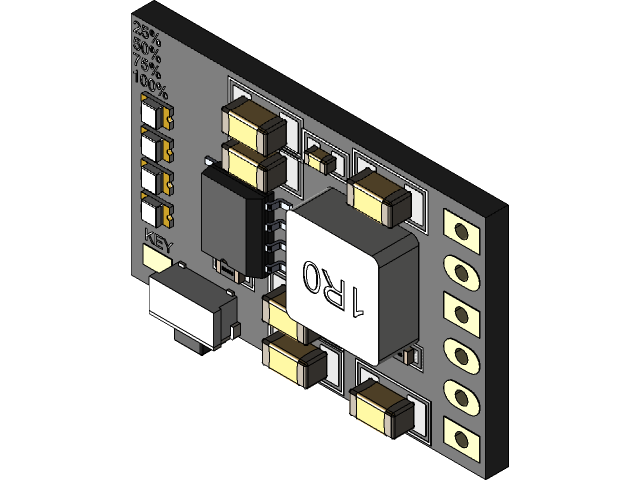

# kicad-cd42-lib

En éste repositorio encuentra tanto el símbolo como el footprint del mh-cd42. El diseño 3D
es descargado desde le plataforma grabcad, de la cual doy créditos de su [autor](https://grabcad.com/k.b-103).

Johnny Cubides
